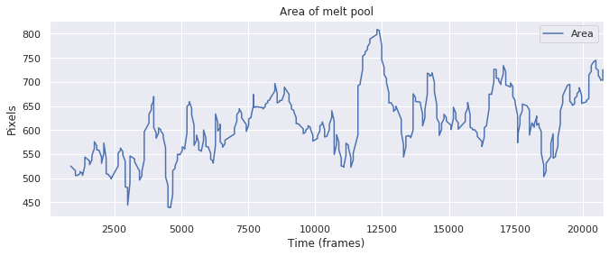
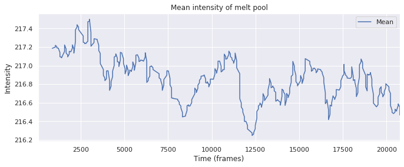
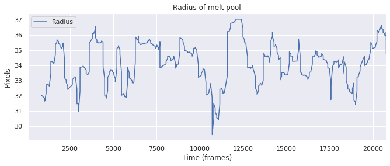

# pool-tracker-pro
Pool Tracker Pro

This is an early prototype for detecting the area where metal is melted in a 3D printer. It monitors variations of metrics of the melt pool in order to detect defects when building the part.

## Video

Software inputs:

Videos of metal 3D printing such as direct metal laser sintering (DMLS), selective laser melting (SLM), etc

Software outputs and metrics:

- area of melt pool
- mean intensity (brightness) of melt pool
- radius of melt pool

Melt pool dynamics chosen from paper:

Clijsters, Stijn, et al. "In situ quality control of the selective laser melting process using a high-speed, real-time melt pool monitoring system." The International Journal of Advanced Manufacturing Technology 75.5-8 (2014): 1089-1101. - https://link.springer.com/article/10.1007/s00170-014-6214-8

Another good paper for more info on metal printing monitoring:

Everton, Sarah K., et al. "Review of in-situ process monitoring and in-situ metrology for metal additive manufacturing." Materials & Design 95 (2016): 431-445. - https://www.sciencedirect.com/science/article/pii/S0264127516300995

Event-based sensors, [such as the Dynamic Vision Sensor (DVS)](https://inivation.com/products/customsolutions/videos/), can be used for monitoring the fast movements of the laser. Thus, the melt pool can be monitored at a higher speed using this type of sensor.
Brain-derived algorithms can possibly be applied to improve the error rate in metal 3D printing, aka additive manufacturing.

Review paper on event-based vision:

Gallego, Guillermo, et al. "Event-based vision: A survey." arXiv preprint arXiv:1904.08405 (2019). - https://arxiv.org/abs/1904.08405
