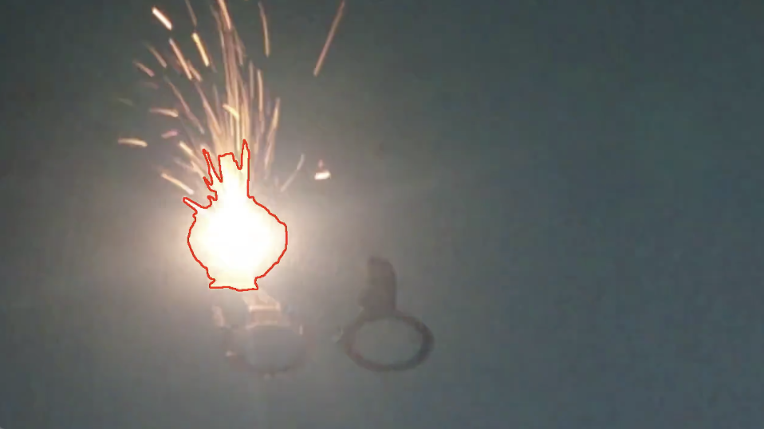

# pool-tracker
Pool Tracker

This is an early prototype for detecting the area where metal is melted in a 3D printer.

Software inputs:

Videos of metal 3D printing such as direct metal laser sintering (DMLS), selective laser melting (SLM), etc

Software outputs:
- area of melt pool
- mean intensity (brightness) of melt pool
- radius of melt pool

The software was developed at Meshflow Limited and was released under the MIT Licence.
